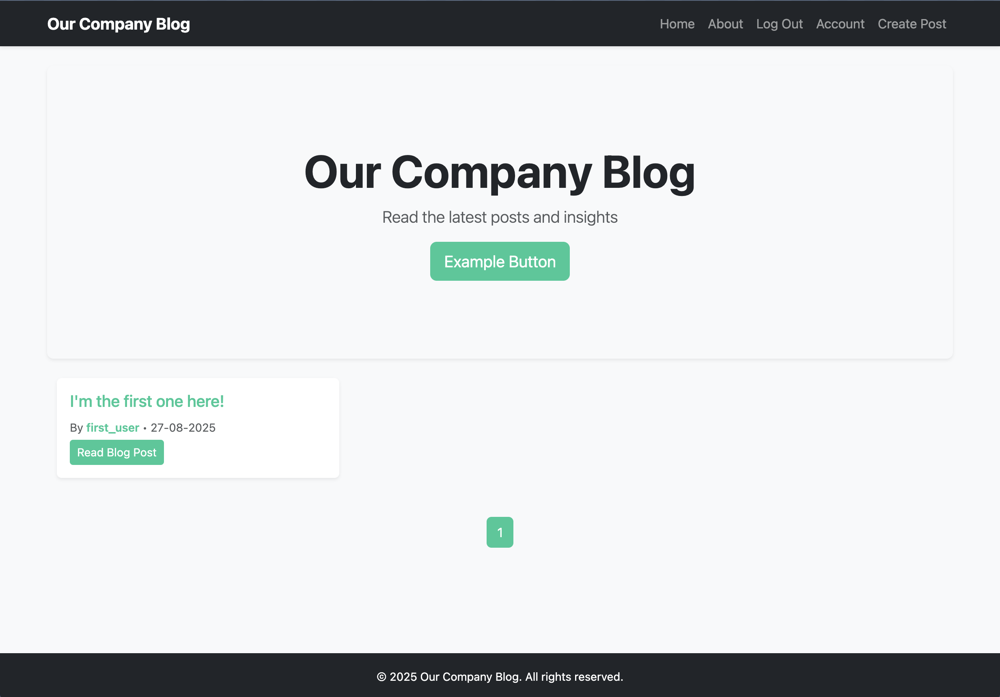
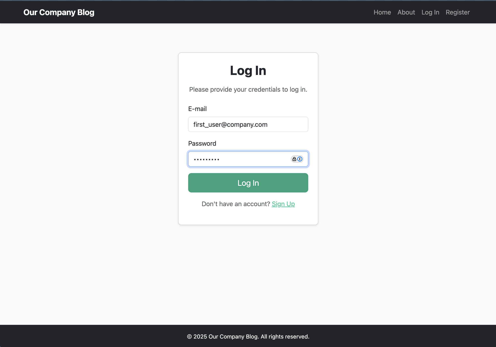
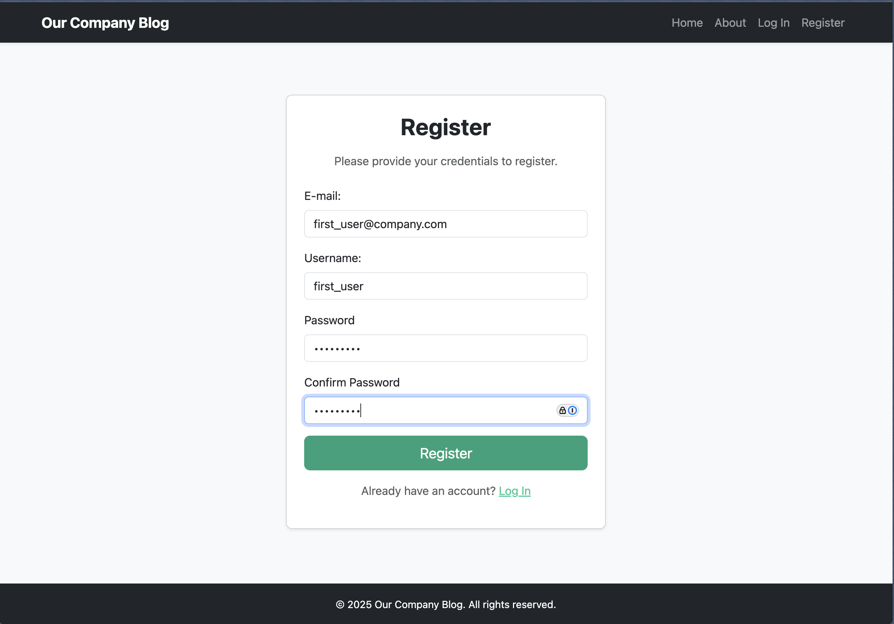
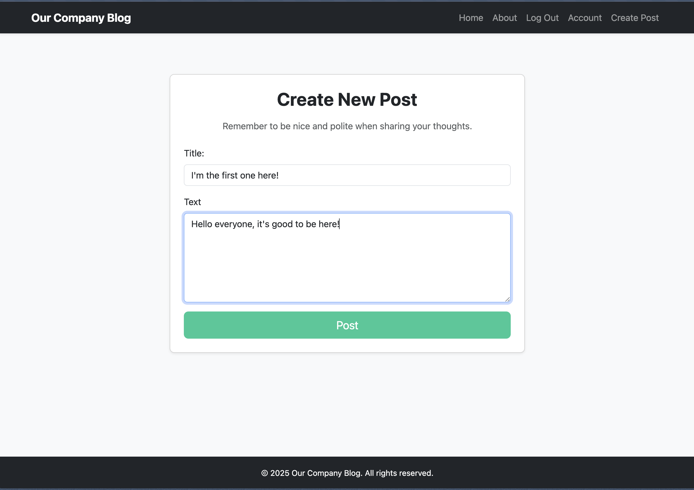
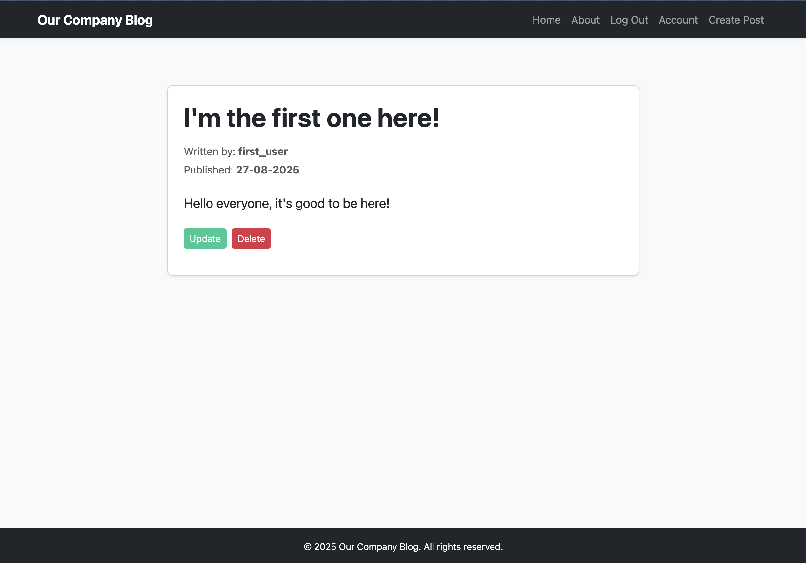
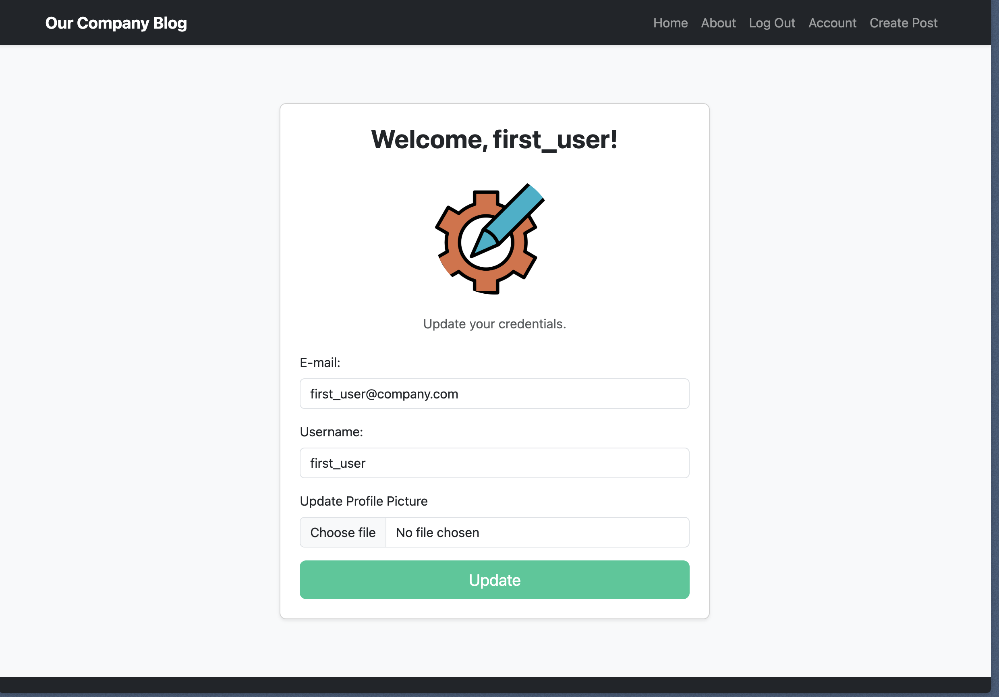

# Our Company Blog Blog

A full-stack blog platform built with Flask, PostgreSQL, and Bootstrap 5

---

## 🚀 Demo

  


Live demo: *(to be added)* 😊

---

## 🎯 Why this project

Our Company Blog is a **fully functional, responsive web application**:  

- **Backend:** Flask routing, authentication, database relationships with SQLAlchemy.  
- **Frontend:** Bootstrap 5 - responsive layout, consistent branding, card and pagination design.  
- **Portfolio readiness:**  CRUD operations, user accounts, and profile handling.  

**Benefits:**  
1. Automates blog management with full CRUD functionality.  
2. Provides a polished, responsive interface 

---

## 🛠 Tech Stack

- **Backend:** Python, Flask  
- **Database:** SQLite, SQLAlchemy  
- **Authentication & Forms:** WTForms, Flask-Login  
- **Frontend:** Bootstrap 5, custom CSS
- **Optional:** Docker for containerization  

---

## ✨ Features

- ✅ User registration, login, and profile management  
- ✅ Upload and display profile pictures  
- ✅ Create, update, delete, and read blog posts  
- ✅ Paginated posts on main and user pages  
- ✅ Fully responsive layout with Bootstrap 5  
- ✅ Consistent teal branding across buttons, card titles, links, and pagination  

---

## 📸 Screenshots

| Login Page | Register Page |
|------------|---------------|
|  |  |

| Creating Post                               | Single Post View |
|---------------------------------------------|-----------------|
|  |  |


| Home Page                      | User Account                          |
|--------------------------------|---------------------------------------|
|  |  |


---

## ⚡ Getting Started (Local)

1. Clone the repository:
    ```bash
    git clone <repo_url>
    ```
2. Create a virtual environment and install dependencies:
    ```bash
    python -m venv venv
    pip install -r requirements.txt
    ```
3. Setup `.env`:
    ```env
    SECRET_KEY=very_secret_key
    SQLITE_DB=data.sqlite
    ```
4. Initialize the database:
    ```bash
    flask db init
    ```
5. Migrate the database:
   ```bash
    flask db migrate -m "Initial migration"
    ```
6. Upgrade the database:
   ```bash
    flask db upgrade
    ```
7. Run the application:
    ```bash
    flask run
    ```

---

## 🗄 DB Schema

**users**

| Column         | Type      | Notes                |
|----------------|-----------|----------------------|
| id             | Integer   | Primary key          |
| username       | String    | Unique               |
| email          | String    | Unique               |
| password       | String    | Hashed               |
| profile_image  | String    | Filename             |

**blog_posts**

| Column      | Type       | Notes                     |
|-------------|-----------|----------------------------|
| id          | Integer   | Primary key                |
| title       | String    | Post title                 |
| text        | Text      | Post content               |
| date        | DateTime  | Published date             |
| user_id     | Integer   | Foreign key → users.id     |

---

## ⚙ Notes on Deployment (Docker)

You can run this app inside a Docker container for consistency across environments.

### 1. Create a Dockerfile
Create a file named `Dockerfile` in your project root with the following content:

```dockerfile
# Use official lightweight Python image
FROM python:3.11-slim

# Set environment variables
ENV PYTHONDONTWRITEBYTECODE=1
ENV PYTHONUNBUFFERED=1

# Set working directory
WORKDIR /app

# Install dependencies
COPY requirements.txt .
RUN pip install --no-cache-dir -r requirements.txt

# Copy project files
COPY . .

# Expose port Flask runs on
EXPOSE 5000

# Default command: run the app
CMD ["flask", "run", "--host=0.0.0.0", "--port=5000"]
```

### 2. Build the Docker image
```bash
docker build -t our-company-blog .
```
This creates a local image called our-company-blog.

### 3. Run the container
Map the container port 5000 to your host port 5001 and load environment variables from .env:
```
docker run -p 5001:5000 --env-file .env our-company-blog
```

### 4. Access the app
Access the app
```bash
http://localhost:5001
```
**Note:** Flask will still log Running on http://127.0.0.1:5000 inside the container — this is normal. Always use the mapped host port in your browser.

### 5. Stopping the container
To stop the container, press CTRL+C in the terminal or run docker ps → docker stop <container_id>.

For production deployments, consider using Gunicorn instead of flask run inside Docker.

---

## 📜 License

MIT

---

